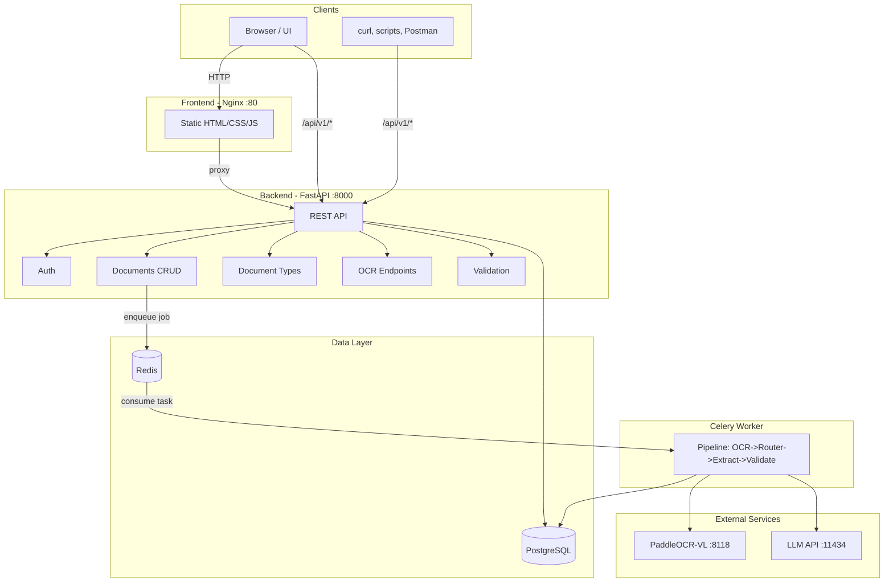

# Doc2JSON Service

Сервис для обработки PDF-документов: OCR, маршрутизация типа документа, извлечение структурированных данных в JSON по заданной схеме.

## Быстрый старт

```bash
docker compose up --build
```

Создание администратора (выполняется один раз после первого запуска):

```bash
docker compose exec backend python create_admin.py admin admin "Administrator"
```

Сервис будет доступен:
- **UI**: http://localhost
- **API**: http://localhost:8000/api/v1
- **Swagger**: http://localhost:8000/docs

### Работа по API без браузера

Сервис полностью доступен через REST API: можно интегрировать его в скрипты, CI/CD, другие приложения без использования веб-интерфейса. 
Варианты работы:

- **Swagger UI** — интерактивная документация и тестирование запросов: http://localhost:8000/docs
- **curl / httpie** — вызовы из командной строки или скриптов
- **Postman, Insomnia** — сборки запросов и переменные окружения
- **Программный доступ** — любой HTTP-клиент (requests, httpx, fetch и т.п.)
---

## Архитектура системы



---

## Роль компонентов

### Backend (FastAPI, порт 8000)

- **REST API** — основной интерфейс для фронтенда и внешних клиентов
- **Auth** — JWT-аутентификация (access + refresh токены), роли (admin, manager, operator)
- **Documents** — загрузка PDF, создание заданий, просмотр статуса и результата, retry
- **Document Types** — CRUD типов документов, JSON Schema, промпты для LLM, версионирование
- **OCR Router** — синхронные endpoints без auth: PDF → Markdown, PDF → JSON (полный pipeline)
- **Validation** — валидация JSON по схеме типа, перепроверка результата job

### Frontend (Nginx + HTML/CSS/JS, порт 80)

- Статический SPA: логин, дашборд, загрузка файлов, просмотр заданий и результатов
- Проксирует запросы `/api/*` на Backend
- Работает с API через `/api/v1`

### PostgreSQL

- **users** — пользователи, пароли, роли, флаг смены пароля
- **document_types** — типы документов: slug, JSON Schema, промпты, постпроцессоры
- **document_type_versions** — история изменений типов (версионирование)
- **jobs** — задания на обработку: статус, результат, ошибки, время выполнения
- **job_files** — загруженные PDF, связь с job

### Redis

- **Broker** (DB 0) — очередь задач Celery: при загрузке PDF Backend кладёт `process_job` в очередь
- **Result Backend** (DB 1) — хранение результатов выполнения задач

### Celery

- **Worker** — выполняет тяжёлую обработку в фоне:
  1. OCR (PaddleOCR-VL) - PDF → Markdown
  2. Маршрутизация - определение типа документа по Markdown (LLM)
  3. Извлечение - Markdown → JSON по схеме типа (LLM)
  4. Постобработка - markdown и JSON постпроцессоры
  5. Валидация - JSON Schema
  6. Сохранение результата в БД и storage

### Внешние сервисы (не в Docker Compose)

| Сервис | Порт | Назначение |
|--------|------|------------|
| **vLLM PaddleOCR-VL** | 8118 | OCR: распознавание текста и разметки в PDF |
| **vLLM LLM** | 11434 | Маршрутизация типа документа и извлечение JSON по промпту |

---

## Поток данных

1. **Загрузка через UI**  
   Пользователь загружает PDF → Frontend вызывает `POST /api/v1/documents/process` → Backend сохраняет файлы, создаёт Job, ставит задачу в Celery → возвращает `job_id`.

2. **Асинхронная обработка**  
   Celery Worker забирает задачу → OCR → постобработка Markdown → маршрутизация (если тип не задан) → извлечение JSON → постобработка JSON → валидация → запись в `jobs` и storage.

3. **Синхронный OCR/JSON (без auth)**  
   `POST /api/v1/ocr/extract-text` и `POST /api/v1/ocr/extract-json` — тот же pipeline выполняется **синхронно** в одном запросе, без создания Job и без записи в БД.  
   **Для чего:** внешние системы (скрипты, CI/CD, другие сервисы), которым нужна «одноразовая» конвертация PDF → Markdown или PDF → JSON. Ответ приходит сразу в теле запроса, без учётной записи и без ожидания очереди.

4. **Просмотр результата**  
   `GET /api/v1/documents/jobs/{id}` — статус, извлечённый JSON, ошибки валидации.

---

## Хранилище (storage)

Том `storage_data` монтируется в `/app/storage` для контейнеров **backend** и **celery-worker**.

**Зачем нужен:** хранение файлов между перезапусками контейнеров. Без монтирования при пересоздании контейнера все загруженные PDF и результаты пропадут.

**Структура каталогов:**

| Путь | Содержимое |
|------|------------|
| `storage/uploads/{year}/{month}/{job_id}/` | Загруженные PDF-файлы |
| `storage/markdown/{year}/{month}/{job_id}/merged.md` | Результат OCR (Markdown) |
| `storage/results/{year}/{month}/{job_id}/result.json` | Извлечённый JSON |

Backend и Celery Worker используют один и тот же storage: backend сохраняет загруженные PDF, Celery Worker читает их для OCR и записывает Markdown и JSON.

---

## Сохранение и получение результатов

### Где сохраняются

| Результат | База данных | Файловая система (storage) |
|-----------|-------------|----------------------------|
| **Markdown** | `jobs.markdown_result` (TEXT) | `markdown/{year}/{month}/{job_id}/merged.md` |
| **JSON** | `jobs.extracted_json` (JSONB) | `results/{year}/{month}/{job_id}/result.json` |

Результаты пишутся и в БД, и на диск. API отдаёт данные из БД.

### Как получить через API

| Что нужно | Endpoint | Auth |
|-----------|----------|------|
| Markdown задания | `GET /api/v1/documents/jobs/{id}/markdown` | Да |
| JSON задания | `GET /api/v1/documents/jobs/{id}/result` | Нет |
| Всё (статус, JSON, ошибки) | `GET /api/v1/documents/jobs/{id}` | Нет |
| Markdown/JSON «на лету» (без Job) | `POST /api/v1/ocr/extract-text`, `POST /api/v1/ocr/extract-json` | Нет — ответ сразу в теле запроса |

Эндпоинты OCR возвращают Markdown или JSON прямо в ответе, без сохранения в storage и без записи в БД.

---

## API

### Документы

| Метод | Endpoint | Описание |
|-------|----------|----------|
| POST | `/api/v1/documents/process` | Загрузить PDF, запустить обработку |
| GET | `/api/v1/documents/jobs` | Список заданий |
| GET | `/api/v1/documents/jobs/{id}` | Статус и результат задания |
| GET | `/api/v1/documents/jobs/{id}/result` | Только JSON |
| GET | `/api/v1/documents/jobs/{id}/markdown` | Только Markdown |
| POST | `/api/v1/documents/jobs/{id}/retry` | Повторить обработку |
| DELETE | `/api/v1/documents/jobs/{id}` | Удалить задание |

### OCR (без аутентификации)

Публичный API для внешних интеграций: скрипты, CI/CD, другие сервисы. UI использует загрузку через `/documents/process` и Job.

| Метод | Endpoint | Описание |
|-------|----------|----------|
| POST | `/api/v1/ocr/extract-text` | PDF → Markdown (ответ сразу в теле) |
| POST | `/api/v1/ocr/extract-json` | PDF → JSON (полный pipeline, ответ сразу в теле) |

### Валидация (без аутентификации)

| Метод | Endpoint | Описание |
|-------|----------|----------|
| POST | `/api/v1/validate` | Валидация JSON по схеме типа |
| POST | `/api/v1/validate/job/{job_id}` | Перепроверить результат job |
| GET | `/api/v1/validate/schema/{slug}` | Получить JSON Schema типа |

### Типы документов

| Метод | Endpoint | Описание |
|-------|----------|----------|
| GET | `/api/v1/document-types` | Список типов |
| GET | `/api/v1/document-types/{slug}` | Детали типа |
| POST | `/api/v1/document-types` | Создать тип (admin) |
| PUT | `/api/v1/document-types/{slug}` | Обновить тип (admin) |
| DELETE | `/api/v1/document-types/{slug}` | Деактивировать (admin) |
| GET | `/api/v1/document-types/{slug}/versions` | История версий |
| POST | `/api/v1/document-types/{slug}/test` | Тест промпта на образце текста |

При создании/обновлении типа поле `json_schema` принимает **полную JSON Schema**: структура (`type`, `properties`), описания (`description`) для LLM и валидации.

---

## Примеры API

### Без аутентификации (curl)

```bash
# PDF → Markdown
curl -X POST "http://localhost:8000/api/v1/ocr/extract-text" \
  -F "files=@document.pdf"

# PDF → JSON (полный pipeline)
curl -X POST "http://localhost:8000/api/v1/ocr/extract-json" \
  -F "files=@document.pdf"

# С указанием типа документа
curl -X POST "http://localhost:8000/api/v1/ocr/extract-json" \
  -F "files=@document.pdf" \
  -F "document_type_slug=accounting_statement"

# Результат Job по UUID (без токена)
curl "http://localhost:8000/api/v1/documents/jobs/{job_id}/result"
```

## Роли

| Роль | Возможности |
|------|-------------|
| admin | Полный контроль, управление пользователями и типами |
| manager | Редактирование типов, просмотр всех заданий |
| operator | Загрузка документов, просмотр своих заданий |

---

## Инфраструктура

| Компонент | Технология | Порт |
|-----------|------------|------|
| Frontend | Nginx + HTML/CSS/JS | 80 |
| Backend | FastAPI | 8000 |
| Celery Worker | Celery | — |
| Database | PostgreSQL 16 | 5432 |
| Broker / Result | Redis 7 | 6379 |

---

## Миграции БД

```bash
docker compose exec backend alembic upgrade head
docker compose exec backend alembic revision --autogenerate -m "description"
```
